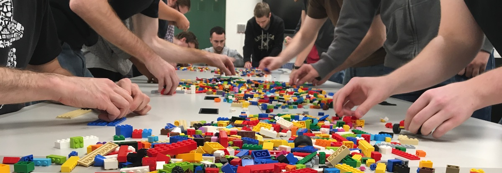
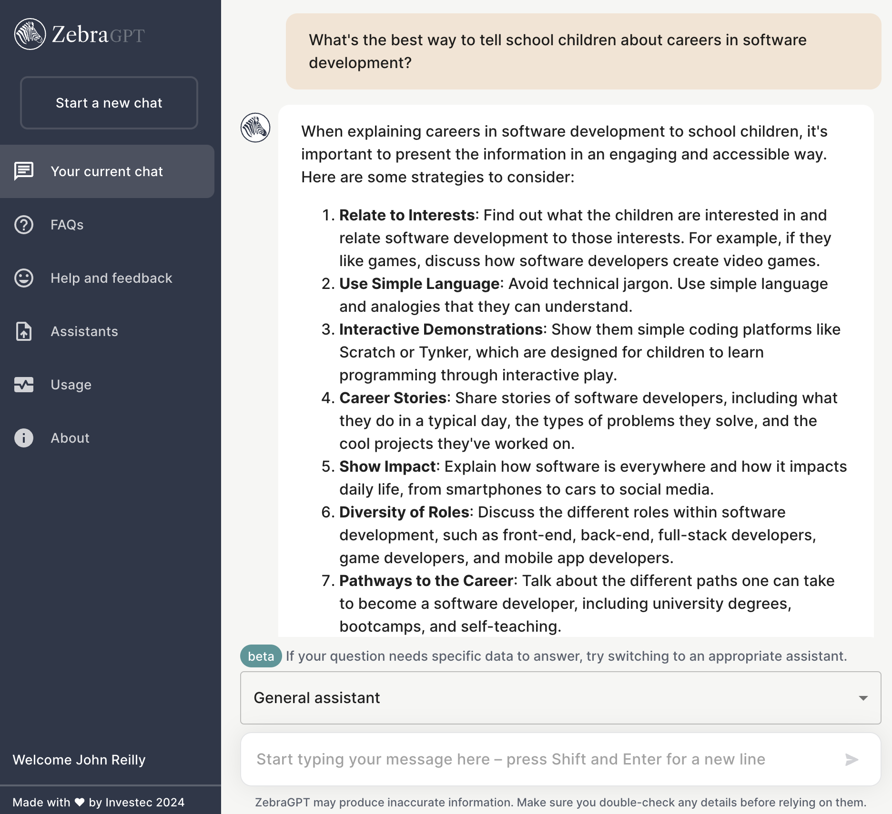
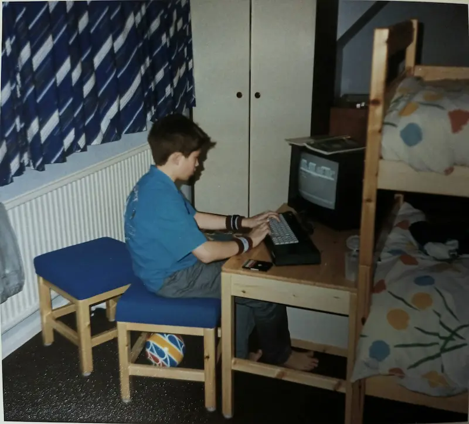
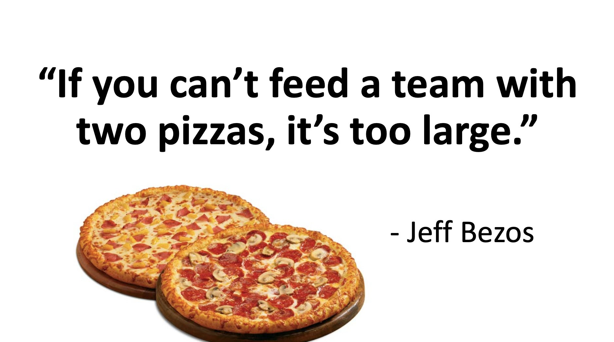
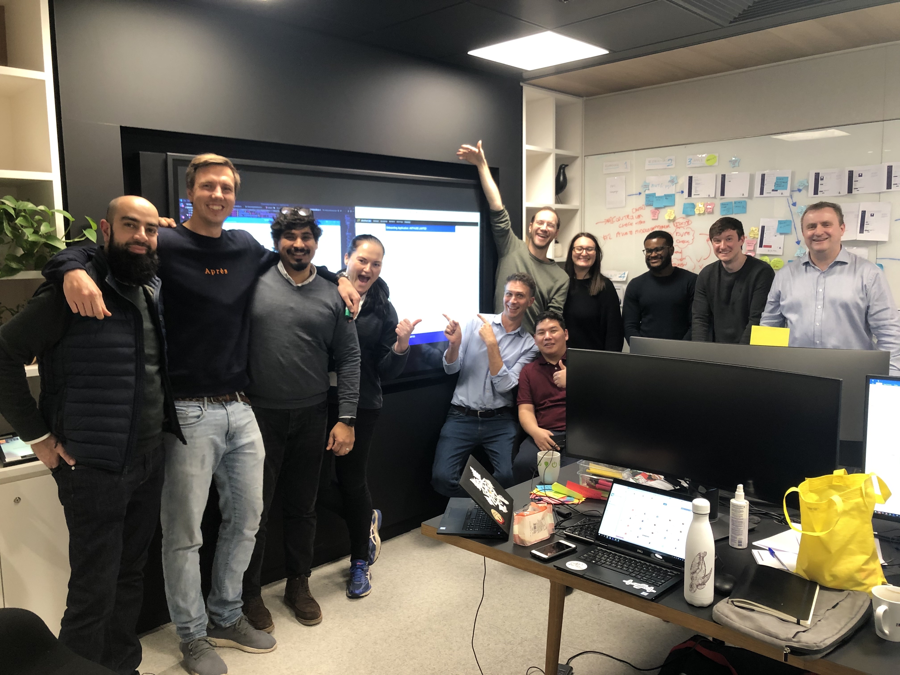
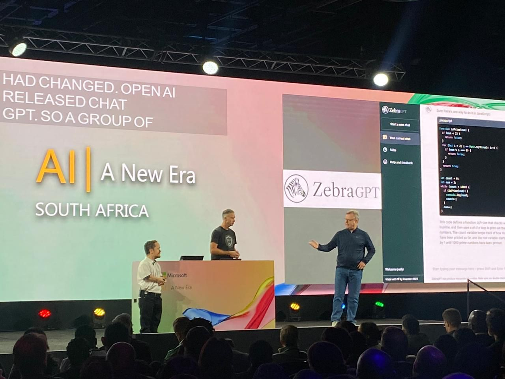

<!-- .slide: data-background="me_and_orson_wells.jpg" -->

# Me & You & Software Engineering

<aside class="notes">
<ul>
<li>Coded since I was 8 years old</li>
<li>Been paid to develop software since I was 22</li>
<li>It's brought me joy, it's made the world slightly better</li>
<li>I want to reduce the mystery</li>
<li>You have permission to interrupt!</li>
</ul>
</aside>

---

## Hi, I'm John.

### I'm a software engineer!

- I blog: https://johnnyreilly.com
- I OSS: https://github.com/johnnyreilly
- I tweet: https://twitter.com/johnny_reilly

<aside class="notes">
<ul>
<li>Software engineers are needed *everywhere*</li>
<li>do you have a phone? it runs software</li>
<li>Working in finance, telecoms, marketing, for Microsoft and others</li>
<li>friends work at Instagram, WhatsApp</li>
</ul>
</aside>

---

### What is software engineering?



LEGO for Software Engineering: https://sites.ccsu.edu/lego-se/

<aside class="notes">
<ul>
<li>Playing with lego for a living</li>
<li>Building things</li>
<li>Taking them apart</li>
<li>Most fun you can have by yourself in a room</li>
<li>Apologies for a mostly male picture - please don't read anything into that</li>
</ul>
</aside>

---

### What might you work on?



<aside class="notes">
<ul>
<li>Honestly, it changes all the time - and that's exciting!</li> 
<li>ZebraGPT - possibly show them the code?</li> 
<li>What have I built?</li>
<li>Something about testers / analysts / product? Not sure</li>
</ul>
</aside>

---

### How did we get here?



<aside class="notes">
<ul>
<li>Dad bought a computer when I was 8</li>
<li>Programming listings</li>
<li>did computer science at a-level, not uni (I wanted to be "cool")</li>
<li>I was an apprentice</li>
</ul>
</aside>

---

### Starting out


<aside class="notes">
<ul>
<li>Didn't do computer science - you might!</li>
<li>Got an apprenticeship - that's cheaper than a degree!</li>
<li>You need experience</li> 
<li>worked in telecoms, marketing, pre oss microsoft, finance</li> 
</ul>
</aside>

---

### Two pizza team!



<aside class="notes">
<ul>
<li>not too big, not too small</li> 
</ul>
</aside>

---

### Teamwork!



<aside class="notes">
<ul>
<li>building software is a team sport</li>
<li>engineers, UI, UX, scrum masters</li>
<li>short iterations and retrospectives?</li>
<li>talk a little about business savings</li>
</ul>
</aside>

---

### Communication!



<aside class="notes">
<ul>
<li>communication really matters</li>
<li>you may have an image of programmers as not talky - that's wrong</li> 
</ul>
</aside>

---

### I'm not a great engineer...

```cs
johnnyreilly == good_engineer + 
                works_hard_at_communicating + 
                curious + 
                enthusiastic
```

<aside class="notes">
<ul>
<li>there are more talented engineers in this room than me</li>
<li>you might doubt yourself - but that's just modesty and imposter syndrome</li>
</ul>
</aside>

---

### What did Software Development do for me?

### 1. Fun
### 2. Profit

<aside class="notes">
<ul>
<li>had fun</li>
<li>made a difference</li>
<li>worked with talented people I might never have encountered</li>
<li>helped get me jobs / work</li>
<li>mostly driven by work I was doing</li>
</ul>
</aside>

---

### What could Software Development do for you?

#### 1. Satisfaction
#### 2. Collaborate
#### 3. Communicate
#### 4. Fun & Profit

<aside class="notes">
<ul>
<li>it could do for you what it did for me</li>
<li>I invite you to consider it</li>
</ul>
</aside>

---

# Demo!

---

# Questions!

---

### Contributing to other open source projects...

- [Docs - Angular.js](https://github.com/angular/angular.js/pull/8773)
- [Docs - jQuery Validation](https://github.com/jquery-validation/validation-content/pull/3)
- [Type Definitions - Definitely Typed](https://github.com/DefinitelyTyped/DefinitelyTyped/pull/841)

<aside class="notes">
<ul>
<li>Very nervous - imposter syndrome</li>
<li>Docs - not "code"</li>
<li>Paris</li>
<li>Why am I telling you this?</li>
<li>driven by work usage</li>
</ul>
</aside>

---

### 2022: `ts-loader`

- From ~5 million downloads per year
- To ~200 million downloads per year

<a href="https://npm-stat.com/charts.html?package=ts-loader&from=2014-01-20&to=2022-09-20"></a>

<aside class="notes">
<ul>
<li>ts-loader used by Bloomberg, Investec, Microsoft, Google etc</li>
</ul>
</aside>

