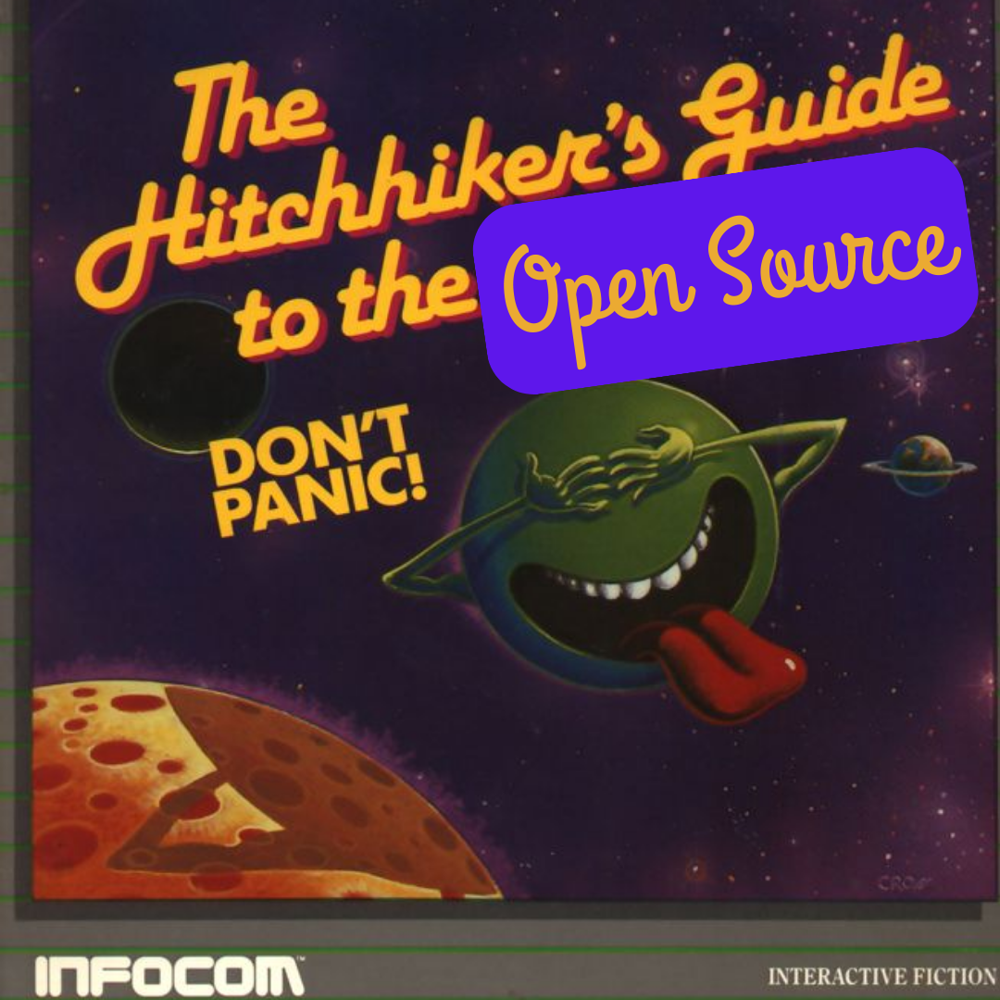
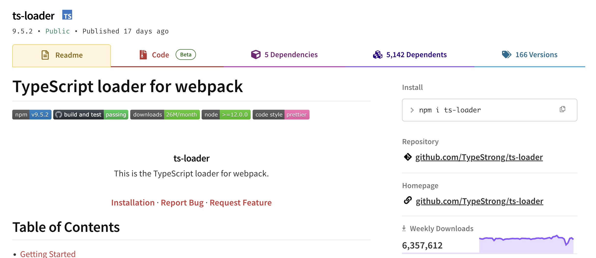
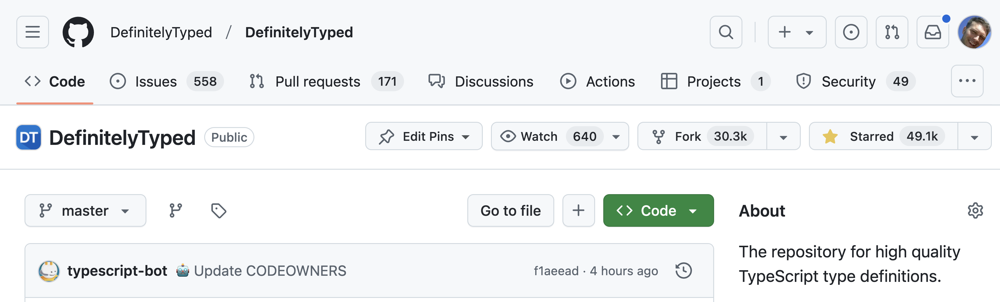
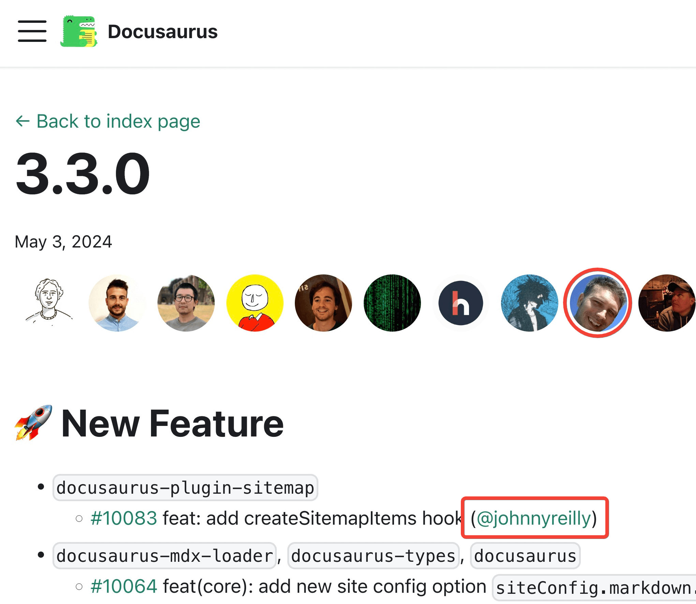
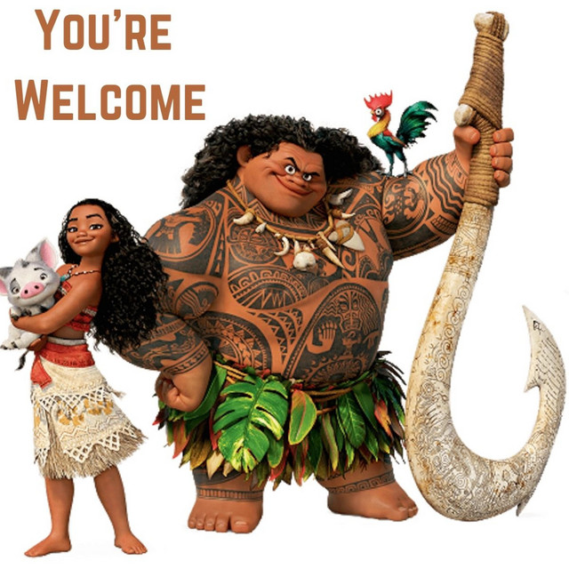
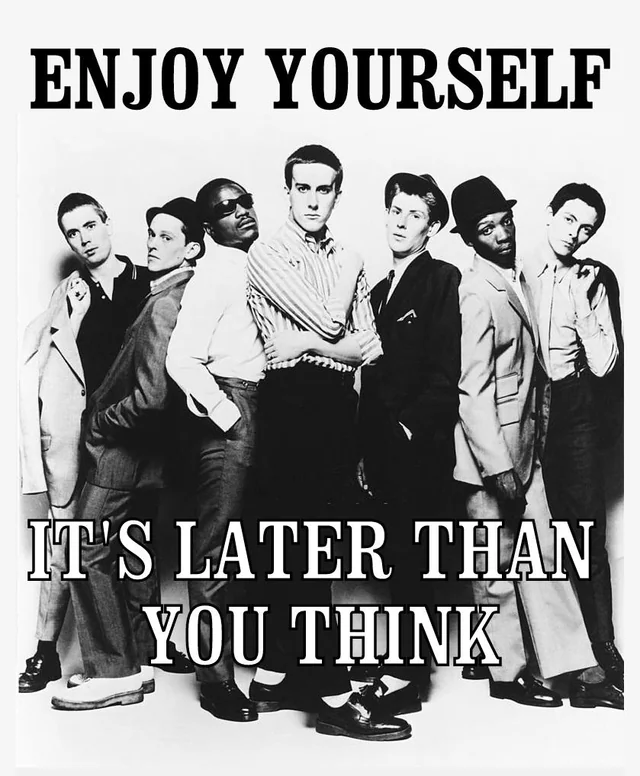

---

## Hi, I'm John.

- I blog: https://johnnyreilly.com
- I OSS: https://github.com/johnnyreilly
- I Bluesky: https://bsky.app/profile/johnnyreilly.com

<aside class="notes">
<ul>
<li>Done open source / blogged for 10 years</li>
<li>It's brought me joy, it's made the world slightly better</li>
<li>Want to share some tips on how to OSS</li>
<li>Worked at Investec for 7 years</li>
</ul>
</aside>

---

### What have I worked on?

ts-loader: https://github.com/TypeStrong/ts-loader



<aside class="notes">
<ul>
<li>ts-loader since 2016 - 25 million downloads a month</li>
</ul>
</aside>

---

### What have I worked on?

<p class="fragment fade-in-then-semi-out">
    Definitely Typed: <a href="https://github.com/DefinitelyTyped/DefinitelyTyped">https://github.com/DefinitelyTyped/DefinitelyTyped</a>
    
</p>
<p class="fragment fade-in-then-semi-out">
    I wrote the history of DT: <a href="https://johnnyreilly.com/definitely-typed-the-movie">https://johnnyreilly.com/definitely-typed-the-movie</a>
</p>


<aside class="notes">
<ul>
<li>Worked on DT heavily until MS got involved</li>
</ul>
</aside>

---

### What have I worked on?

Docusaurus: https://github.com/facebook/docusaurus



<aside class="notes">
<ul>
<li>Powers my blog</li>
</ul>
</aside>

---

### Tip #1: Impostor syndrome

"I'm not a great engineer..."

```cs
johnnyreilly == good_engineer + 
                works_hard_at_communicating + 
                curious + 
                enthusiastic
```

<aside class="notes">
<ul>
<li>there are more talented engineers in this room than me</li>
<li>you might doubt yourself - but that's just modesty and imposter syndrome</li>
<li>notice it and push through it</li>
</ul>
</aside>

---

### Tip #2: You belong with me

- What are you interested in?
- What do you use?
- Look at `Contributing.md`
- You're welcome...?



<aside class="notes">
<ul>
<li>Do you align with the direction of the project?</li>
<li>is this a welcoming community</li> 
<li>Invest wisely - if you feel unwelcome then leave</li>
<li>be aware of not first language folk</li> 
<li>is this project active </li>
</ul>
</aside>

---

### Tip #3: Docs and tests!

<aside class="notes">
<ul>
<li>Docs and tests are the best way to get started</li>
<li>They're the best way to learn the codebase</li>
</ul>
</aside>

---

### Tip #3: Docs and tests!

#### My first contributions...

- [Docs - Angular.js](https://github.com/angular/angular.js/pull/8773)
- [Docs - jQuery Validation](https://github.com/jquery-validation/validation-content/pull/3)
- [Type Definitions - Definitely Typed](https://github.com/DefinitelyTyped/DefinitelyTyped/pull/841)

<aside class="notes">
<ul>
<li>Very nervous - imposter syndrome</li>
<li>Docs - not "code"</li>
<li>Paris</li>
<li>Why am I telling you this?</li>
<li>driven by work usage</li>
</ul>
</aside>

---

### Tip #4: Written communication


<aside class="notes">
<ul>
<li>Written communication is hard</li>
<li>emojis</li>
<li>Put the same energy into reading</li>
<li>Assume good intent</li>
</ul>
</aside>

---

### Tip #5: You can't push water uphill

Here’s an example of proposal that was welcomed and ended up landing: https://github.com/facebook/docusaurus/issues/9274 

Here’s an example of a PR / proposal that did not land: https://github.com/facebook/docusaurus/pull/10105 

<aside class="notes">
<ul>
<li>you might want to do things that don't align with the project</li>
</ul>
</aside>

---

### Tip #6: Perspective is everything

- Your time is a gift
- You owe no-one anything
- Mental health is key 

---

### Tip #7: Just get going!


<aside class="notes">
<ul>
<li>this is me at 21, *not* doing OSS</li> 
</ul>
</aside>

---

### Tip #7: Just get going!


<aside class="notes">
<ul>
<li>This is me years later when my son was born when I started</li>
<li>Don't take as long as I did!</li>
</ul>
</aside>

---



<aside class="notes">
<ul>
<li>Have fun!</li>
<li>Invest wisely - if you feel unwelcome then leave</li>
<li>Be welcoming / kind</li>
</ul>
</aside>

---

<!-- .slide: data-background="hitchhikers-guide-to-the-open-source.png"  data-background-repeat="repeat" data-background-size="150px" -->

# Questions?

---

### 2016: `ts-loader`

<a href="https://blog.johnnyreilly.com/2016/11/01/but-you-cant-die-i-love-you-ts-loader"></a>

<aside class="notes">
<ul>
<li>ts-loader abandoned</li>
<li>decided to help</li>
<li>still totally imposter</li>
</ul>
</aside>

---

### 2016: `ts-loader`

<a href="https://blog.johnnyreilly.com/2016/11/01/but-you-cant-die-i-love-you-ts-loader"></a>

<aside class="notes">
<ul>
<li>high maintenance</li>
<li>decided to make it easier to work on</li>
<li>I needed it</li>
<li>I was having fun!</li>
</ul>
</aside>

---

### 2022: `ts-loader`

- From ~5 million downloads per year
- To ~200 million downloads per year

<a href="https://npm-stat.com/charts.html?package=ts-loader&from=2014-01-20&to=2022-09-20"></a>

<aside class="notes">
<ul>
<li>ts-loader used by Bloomberg, Investec, Microsoft, Google etc</li>
</ul>
</aside>

---

### What could OSS do for you?

#### 1. Build your brand
#### 2. Collaborate
#### 3. Communicate
#### 4. Fun & Profit

<aside class="notes">
<ul>
<li>it could do for you what it did for me</li>
<li>I invite you to consider it</li>
</ul>
</aside>

---


