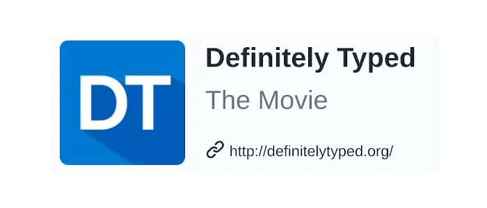

<!-- .slide: data-background="me_and_orson_wells.jpg" -->

# Me & Open Source

<aside class="notes">
<ul>
<li>Done open source / blogged for 10 years</li>
<li>It's brought me joy, it's made the world slightly better</li>
<li>I want to reduce the mystery</li>
</ul>
</aside>

---

## Hi, I'm John.

- I blog: https://johnnyreilly.com
- I OSS: https://github.com/johnnyreilly
- I tweet: https://twitter.com/johnny_reilly
- I toot(?): https://fosstodon.org/@johnny_reilly

<aside class="notes">
<ul>
<li>Worked at Investec for 5 years</li>
<li>What I do outside of work</li>
</ul>
</aside>

---

### Let me take you back...


<aside class="notes">
<ul>
<li>Dad bought a computer when I was 8</li>
<li>Programming listings</li>
<li>did computer science at a-level, not uni</li>
</ul>
</aside>

---

### Starting out


<aside class="notes">
<ul>
<li>Didn't do computer science</li>
<li>Got an apprenticeship</li>
<li>worked in telecoms, marketing, pre oss microsoft, finance</li> 
</ul>
</aside>

---

### OSS goes mainstream:
### GitHub


"I can see code!"

<aside class="notes">
<ul>
<li>Started to see OSS projects 2008</li>
</ul>
</aside>

---

### OSS goes mainstream:
### Microsoft


"This is for me?"

<aside class="notes">
<ul>
<li>Microsoft and OSS 2007</li>
<li>Scott Hanselman</li>
<li>John Resig - jQuery (my JS journey from 1999?)</li>
<li>should i be doing something?</li>
</ul>
</aside>


https://en.wikipedia.org/wiki/GitHub

---

### Hello world


<aside class="notes">
<ul>
<li>My son was born</li>
<li>Start blogging</li>
<li>Start OSS</li>
</ul>
</aside>

---

### My first open source project!

<a href="https://github.com/johnnyreilly/jQuery.Validation.Unobtrusive.Native" target="_blank">`jQuery.Validation.Unobtrusive.Native`</a>

<aside class="notes">
<ul>
<li>jQuery Validation</li>
<li>Spotted a gap</li>
<li>used with Knockout JS</li>
<li>driven by work usage</li>
</ul>
</aside>

---

### Contributing to other open source projects...

- [Docs - Angular.js](https://github.com/angular/angular.js/pull/8773)
- [Docs - jQuery Validation](https://github.com/jquery-validation/validation-content/pull/3)
- [Type Definitions - Definitely Typed](https://github.com/DefinitelyTyped/DefinitelyTyped/pull/841)

<aside class="notes">
<ul>
<li>Very nervous - imposter syndrome</li>
<li>Docs - not "code"</li>
<li>Paris</li>
<li>built my confidence</li>
<li>driven by work usage</li>
</ul>
</aside>

---

### Definitely Typed!

https://johnnyreilly.com/definitely-typed-the-movie

[](https://johnnyreilly.com/definitely-typed-the-movie)

<aside class="notes">
<ul>
<li>I wrote the history because I was there</li>
<li>I used DT because I like TS</li>
<li>I made jQuery a *really* good type definition</li>
<li>whistlestop tour?</li>
</ul>
</aside>

---

### 2016: `ts-loader`

<a href="https://blog.johnnyreilly.com/2016/11/01/but-you-cant-die-i-love-you-ts-loader"></a>

<aside class="notes">
<ul>
<li>ts-loader abandoned</li>
<li>decided to help</li>
<li>still totally imposter</li>
</ul>
</aside>

---

### 2016: `ts-loader`

<a href="https://blog.johnnyreilly.com/2016/11/01/but-you-cant-die-i-love-you-ts-loader"></a>

<aside class="notes">
<ul>
<li>high maintenance</li>
<li>decided to make it easier to work on</li>
<li>I needed it</li>
<li>I was having fun!</li>
</ul>
</aside>

---

### 2022: `ts-loader`

- From ~5 million downloads per year
- To ~270 million downloads per year

<a href="https://npm-stat.com/charts.html?package=ts-loader&from=2014-01-20&to=2022-09-20"></a>

<aside class="notes">
<ul>
<li>ts-loader used by Bloomberg, Investec, Microsoft, Google, Cloudflare (?) etc</li>
</ul>
</aside>

---

### I'm not the best engineer...

```cs
johnnyreilly === good_engineer + 
                 works_hard_at_communicating + 
                 curious + 
                 enthusiastic
```

<aside class="notes">
<ul>
<li>there are more talented engineers in this room than me</li>
<li>you might doubt yourself - but that's just modesty and imposter syndrome</li>
</ul>
</aside>

---

### What did OSS do for me?

### 1. Fun
### 2. Profit

<aside class="notes">
<ul>
<li>had fun</li>
<li>made a difference</li>
<li>worked with talented people I might never have encountered</li>
<li>helped get me jobs / work</li>
<li>mostly driven by work I was doing</li>
</ul>
</aside>

---

### What could OSS do for you?

#### 1. Build your brand
#### 2. Collaborate
#### 3. Communicate
#### 4. Fun & Profit

<aside class="notes">
<ul>
<li>it could do for you what it did for me</li>
<li>I invite you to consider it</li>
</ul>
</aside>

---

### Enjoy yourself!


